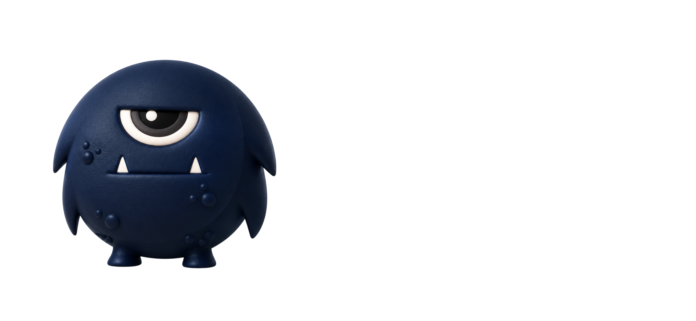
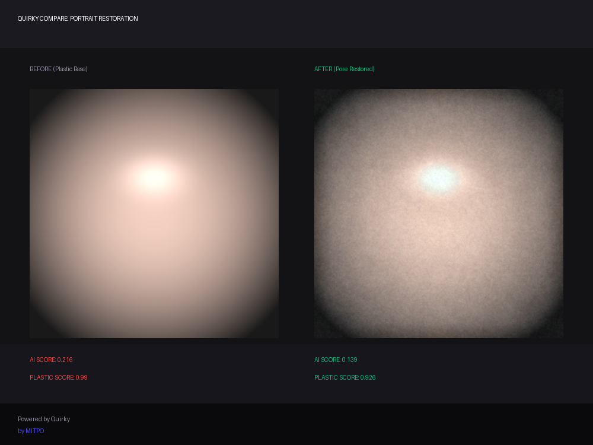

<p align="center">
  
</p>

<p align="center">
  <a href="https://opensource.org/licenses/Apache-2.0"></a>
  
  
  
  
</p>

<p align="center">
  <b>A local-first engine that puts human imperfection back into AI-generated media.</b><br/>
  Pure math &amp; physics — no cloud, no GPU, no model weights, no API keys.
</p>

<p align="center">
  <b><a href="#quickstart">Quickstart</a></b> &nbsp;•&nbsp;
  <b><a href="#coding-agent-integration">Coding Agent Integration</a></b> &nbsp;•&nbsp;
  <b><a href="#before--after">Before / After</a></b> &nbsp;•&nbsp;
  <b><a href="#how-it-works-the-math">The Science & Math</a></b> &nbsp;•&nbsp;
  <b><a href="#web-dashboard-optional">Web Dashboard</a></b> &nbsp;•&nbsp;
  <b><a href="#benchmarks">Benchmarks</a></b>
</p>

---

## Why this exists

Foundation models (diffusion image models, TTS, LLMs) all converge on the same **"synthetic signature."** Their output is too clean, too smooth, too symmetric, too regular — and both humans and detectors pick up on it instantly.

| The AI-slop tells | Where it shows up |
| --- | --- |
| 🫥 **Plastic skin / no micro-texture** | Diffusion portraits look airbrushed; flat gradients, no pores |
| 🪞 **Unnatural symmetry** | Generated faces are near pixel-perfect mirror images |
| 📈 **Wrong frequency statistics** | AI images miss the natural `1/f` power spectrum; leave grid artifacts |
| 🎨 **Broken color correlation** | No camera-sensor (Bayer/demosaic) cross-channel detail |
| 🤖 **Robotic voice** | TTS has no jitter/shimmer, static spectral tilt, no breathing |
| 📝 **Flat prose** | LLM text is low-burstiness and stuffed with "Furthermore…", "Moreover…" |

These are not "quality" problems you fix with a bigger model — they are **statistical fingerprints** of the generation process itself.

## The fix

Quirky is a **post-generation alignment layer**. It sits *after* your generator and reconstructs the micro-imperfections real media has, using cheap, well-understood signal-processing and physics — not another neural net.

```
Your generator  ──►  Quirky (local math)  ──►  Humanized output
 (Flux, TTS, LLM)      analyze · restore         natural, camera-real
```

| Modality | What Quirky restores | The math |
| --- | --- | --- |
| **Image** | Sensor grain, natural spectrum, color correlation | Poisson–Gaussian shot noise, `1/f` spectral shaping, Bayer demosaic round-trip |
| **Audio** | Pitch jitter, amplitude shimmer, breathiness | Per-pitch-period perturbation, pink-noise micro-prosody, drifting glottal tilt |
| **Text** | Sentence-length variety, human punctuation | Burstiness targeting, Zipf-Mandelbrot sculpting, trope removal |
| **Detector** | Passive scoring (no editing) | DFT anomaly, LBP entropy, spectral-slope, channel correlation |

---

## Before / After

Run on fresh AI-slop samples (smooth, symmetric, cold-cast, over-blurred image; metronomic formant speech; rigid linear-motion video; boilerplate LLM text). Numbers are the **passive detector scores** before vs. after a single local pass. Lower `ai_score`/`plastic_score` and a `spectral_slope` closer to the natural **−2** mean *more human*.

<p align="center">
  
</p>

**Image** (`intensity 60`) — the engine first *analyzes* the image with classical CV and applied exactly what this sample needed: `white_balance 0.32` (caught the cold-blue cast), `clahe_lighting 0.36` (caught the flat lighting), plus grain/spectrum/color physics:

| Metric | Before (AI slop) | After (Quirky) | Direction |
| --- | ---: | ---: | :---: |
| `ai_score` | 0.289 | **0.112** | ↓ better |
| `plastic_score` | 0.990 | **0.947** | ↓ better |
| `spectral_slope` (natural ≈ −2) | −3.57 | **−2.52** | → natural |
| `channel_corr` (camera-like) | 0.074 | **0.430** | ↑ better |

**Text** — output is guaranteed free of em/en dashes and ellipses (the classic AI tells):

| | Sample | `ai_score` |
| --- | --- | ---: |
| **Before** | *"Furthermore, it is important to note that this approach facilitates optimization. Moreover, one must utilize structured systems…"* | 0.99 |
| **After** | *"Plus, honestly, this is how you actually make it run faster. On top of that, one must use structured systems…"* | **0.60** |

**Speech** — pitch-period jitter/shimmer, downward intonation drift, phrase-final lengthening, and occasional micro-pauses are inserted; verify by ear or with the eval suite (the crude envelope metrics saturate on synthetic tones).

**Video** — handheld camera drift + rolling-shutter correction applied frame-by-frame; all 40/40 frames preserved. (Frame-wise detector scores barely move by design — the humanization here is *motion*, not per-frame texture.)

> Reproduce everything: `uv run python quirky/benchmarks/eval_suite.py`

---

## Quickstart

No API key. No GPU. No downloads of model weights. It runs entirely on your machine.

```bash
# 1. Install (uses uv — https://github.com/astral-sh/uv)
git clone https://github.com/MITPOAI/Quirky.git && cd Quirky
uv venv && uv pip install -e .
# optional power-ups:  uv pip install -e ".[vision]"   (face targeting)
#                      uv pip install -e ".[dl]"       (neural upscale/repaint/voice)

# 2. Score any asset (passive — never edits it)
uv run quirky detect --asset sample.png

# 3. Humanize it (restore texture / pores / grain)
uv run quirky humanize --asset sample.png --output restored.png --intensity 60

# 4. Generate a shareable before/after card
uv run quirky compare sample.png restored.png --output card.png
```

Works on images (`.png/.jpg/.webp`), audio (`.wav`), and text (`.txt/.md`).

## Do I need an API or another AI model?

**No — the core needs nothing but Python.** This is the point of the project:

- ❌ No OpenAI / Anthropic / any generation API.
- ❌ No GPU, CUDA, or model weights in the **core** (no SAM2 / diffusion / transformers).
- ✅ 100% local math + classical CV on NumPy / SciPy / OpenCV / librosa.
- ✅ Your media never leaves your machine — zero data leak.

Quirky **post-processes** media you already have. Two **opt-in** power-ups exist for
people who want more, and neither touches the core:

| Extra | Adds | Weights |
| --- | --- | --- |
| `pip install quirky[vision]` | Precise **face targeting** (MediaPipe FaceMesh) for spot-removal & relighting | ~10 MB, CPU |
| `pip install quirky[dl]` | Neural **upscale / repaint / face-restore** + **voice cloning** (ONNX Runtime) | downloaded on first use, cached locally |

Without the extras, the classical touch-up (below) still runs, fully offline.

## Touch-up & restoration

Beyond adding grain, Quirky does real, content-aware repair — and it **decides what to
fix by measuring the image first** (classical CV, no learning):

- **Spot / blemish removal** — morphology finds stray specks and over-rendered pores; `cv2.inpaint` reconstructs them from surrounding pixels (not a blur). Core, offline.
- **Physical relighting** — splits luminance into illumination vs. reflectance (Retinex), compresses flat HDR glow, re-injects micro-shadow. Core, offline.
- **Face targeting** — with `quirky[vision]`, MediaPipe FaceMesh scopes the fixes to the actual face; without it, a skin+saliency mask is used instead.
- **Neural power-ups** — with `quirky[dl]`: `quirky upscale` (Real-ESRGAN), `quirky repaint` (LaMa inpaint), face restore (GFPGAN), and `quirky voice-clone` (zero-shot voice conversion — re-timbre existing audio toward a reference voice). CPU by default, CUDA if present, commercial-safe checkpoints only.

```bash
# classical, no extras:
uv run quirky humanize -a portrait.png -o clean.png -i 60   # spot-removal + relight included

# with the neural extra:
uv pip install -e ".[dl]"
uv run quirky upscale     -a small.png  -o big.png
uv run quirky voice-clone -a speech.wav -r target_voice.wav -o cloned.wav
```

> Honest status: the `[dl]` framework (ONNX runtime, model registry, download/cache, CPU/CUDA selection) is functional and `upscale` is implemented end-to-end; `repaint` / face-restore / `voice-clone` are wired to the registry and pull their checkpoints on first run. Verify each model's license before shipping commercially — the registry pins Apache/MIT/BSD only.

## Web dashboard (optional)

A local FastAPI + static dashboard with upload, intensity sliders, and a before/after slider.

```bash
uv run quirky serve
# open http://127.0.0.1:8000   (custom: quirky serve --host 0.0.0.0 --port 9000)
```

## Use it as a library

```python
from quirky.detector.engine import DetectorEngine
from quirky.image.pipeline import ImageHumanizer

scores = DetectorEngine.analyze_asset("ai_image.png")["metadata"]
meta   = ImageHumanizer.humanize("ai_image.png", "out.png", intensity=0.6)
print(meta["attribution"])   # "Powered by Quirky (MITPO)"
```

---

## How it works (the math)

| Technique | One-liner | Replaces |
| --- | --- | --- |
| **Poisson–Gaussian noise** | Per-pixel σ = √(a·I + b): photon shot noise + read floor | flat Gaussian grain |
| **1/f spectral shaping** | Recolors grain to the natural power-law spectrum of photos | white noise |
| **Bayer demosaic round-trip** | Re-imprints camera cross-channel color correlation | (missing entirely) |
| **Pitch-period jitter/shimmer** | Human-range ±0.5–1% / ±3–5% via light `librosa` F0 | robotic steady pitch |
| **Pink-noise micro-prosody** | 1/f drift of pitch and loudness + drifting glottal tilt | static delivery |
| **Intonation & pauses** | F0 declination, phrase-final lengthening, micro-pauses | metronomic TTS timing |
| **Classical-CV analysis** | Saliency (2007), gray-world WB, CLAHE, Retinex (1971) measure what's wrong and fix only that | blind global filters |
| **Burstiness targeting** | Push sentence-length variance toward the human range | uniform AI sentences |
| **Dash-free cleanup** | Strips every em/en dash and ellipsis from output | the #1 lexical AI tell |

Full write-up and formulas live in [`docs/`](docs/) and the module docstrings.

## Architecture

```
quirky/
├── detector/   # passive scoring — DFT, LBP, spectral-slope, channel-corr
├── image/      # Poisson-Gaussian grain, 1/f shaping, Bayer round-trip
├── audio/      # VAD, pitch jitter/shimmer, spectral tilt, breath
├── text/       # burstiness, Zipf sculpting, punctuation rhythm
├── cli/        # Typer CLI: detect / humanize / compare
├── api/        # FastAPI server + static web dashboard
├── sdk/        # Python client for the managed API
└── benchmarks/ # eval_suite.py (latency + integrity), bench.py
```

Every directory is an independent package — import only what you need.

## Benchmarks

```bash
uv run python quirky/benchmarks/eval_suite.py   # 100-iter latency + P99 + attribution check
uv run python quirky/benchmarks/bench.py        # detector statistics
```

Text humanization runs **&lt; 1 ms**. Image/audio full pipelines are heavier (the image path includes a bilateral-filter restoration stage; audio includes `librosa` F0) — see the eval-suite notes for the isolated-transform timings and how to amortize F0 for strict latency.

## Coding agent integration

Quirky is fully integrated into Claude Code, Cursor, and Codex through a shared, portable layer:

- **MCP server** — exposes `quirky_score_text`, `quirky_critique_text`, `quirky_fix_text`, `quirky_tighten_text`, `quirky_detect_media`, and `quirky_humanize_media` as tools any MCP-capable agent can call, enabling in-editor fixing and humanization.
- **Idempotent scaffolding (`quirky init`)** — sets up a single root `AGENTS.md` (read natively by Codex and Cursor), a one-line `CLAUDE.md` referencing it, and a `.cursor/rules/quirky.mdc` rule file, enforcing a clean, anti-slop house style everywhere.
- **Auto-check hooks (Claude Code)** — configures `PostToolUse` and `Stop` hooks that run the slop scorer on prose files and return surgical fixes or block commits when slop is detected.

To configure these coding integrations, see the [Cross-Tool Integration Guide](docs/CROSSTOOL.md) or use this quickstart:

```bash
# 1. Initialize rules & configurations in your target repo path:
uv run quirky init --path /path/to/repo

# 2. Add and install the Claude Code plugin globally:
claude plugin marketplace add MITPOAI/Quirky
claude plugin install quirky
```

## Contributing

- Issues labeled `good-first-issue` and `help-wanted` are curated for newcomers.
- Add a dictionary entry, a new detector metric, or a comparison plugin.
- Open a PR — active contributors are featured in release notes.

## License

Apache License 2.0 — see [LICENSE](LICENSE). Every processed asset carries a `Powered by Quirky (MITPO)` attribution in its returned metadata.
